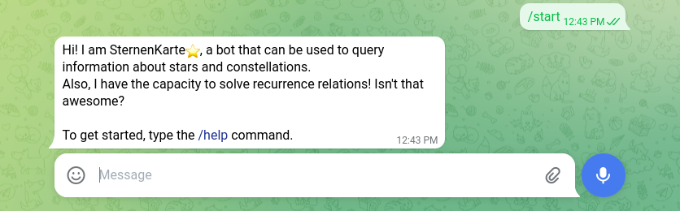

<div align="center">
  
  <h1 align="center">sternenkarte</h1>
  <p align="center">Telegram bot to query information about stars, constellations and recurrence relations</p>
</div>

<br/>

<!-- Badges -->
<div align="center">
  <a href="https://github.com/manzeloth/sternenkarte-bot/blob/main/LICENSE">
    
  </a>
  <a href="https://www.python.org/">
    
  </a>
  <a href="https://t.me/sternenkarte_bot/">
    
  </a>
  <a href="https://www.codefactor.io/repository/github/manzeloth/sternenkarte-bot">
    
  </a>

  <!-- Example img -->
  <hr />

  
  
</div>

<br/>

## 📚 How to use

As shown in the screenshot above, you can use the `/start` command to start the conversation.

You may also use the `/help` command to get a list of the functions the bot can do, such as:

* 🔁 Solve recurrence relation (especially, inhomogeneous) with `/rsolve`

* 🌌 Get data of stars and constellations with `/constellations`

**BONUS:** The bot is trained to answer to things like "Hello" or "How are you?". Try to say hello to the bot!

## Public demo/Self-host

You can either try the public demo <a href="https://t.me/sternenkarte_bot/">here</a>, or you can download the source code in this repository following these instructions:

1. Clone this repository locally (you can also, click on the green `Code` button, download the .zip file and extract it)

```bash
git clone https://github.com/manzeloth/sternenkarte-bot.git
```

2. Navigate to the folder

```bash
cd sternenkarte-bot
```

3. Install requirements with `pip` (you require Python 3.10 or above for this)

```bash
pip install -r requirements.txt
```

4. Get a bot TOKEN from @BotFather on Telegram. If you don't know how to create a bot, click <a href="https://www.freecodecamp.org/news/how-to-create-a-telegram-bot-using-python/">here</a>.

5. Once you have a bot TOKEN, execute the main script of the project:

```bash
python main.py
```

## Hosted on

<a href="https://www.codefactor.io/repository/github/manzeloth/sternenkarte-bot">
    
  </a>